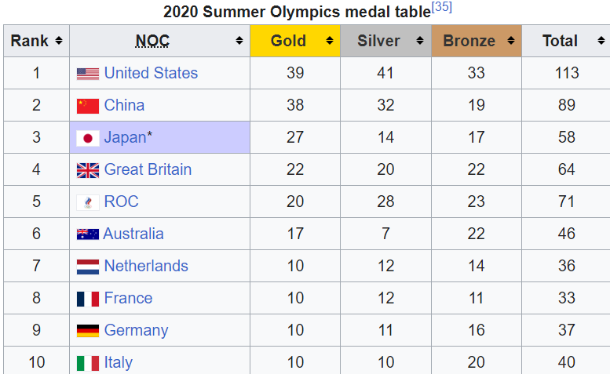
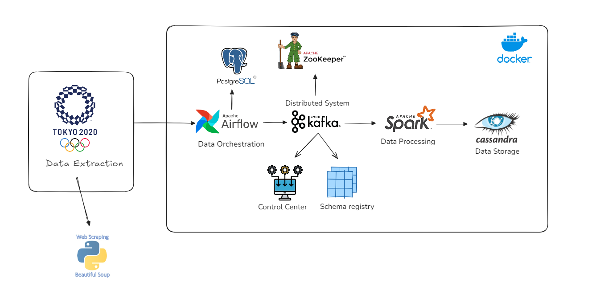
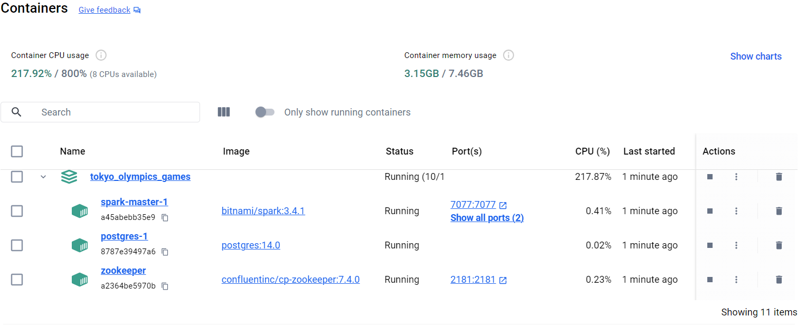
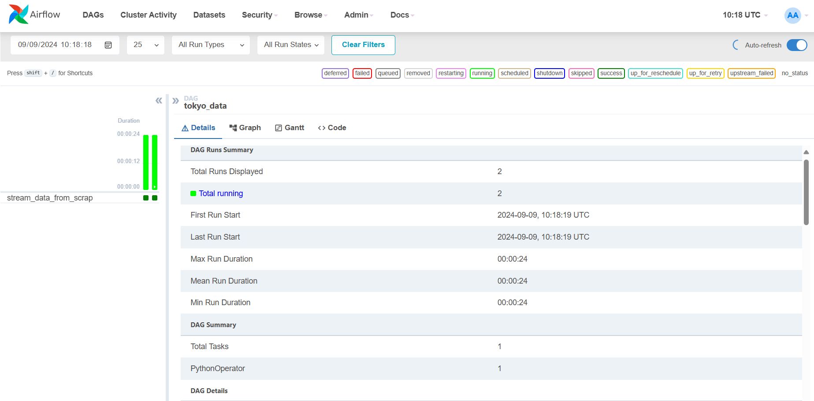

# Real-Time-Tokyo-Games-Analysis-
## Introduction
In this project , we will perform  a real time data analysis by leveraging  the capabilities  of data streaming platforms primarly kafka and spark.
## Context of the project : 
Our Analysis will be conducted on countries achievements in olympic games concerning the 2020 edition held at Tokyo .

Olympic games are the world's leading international sporting events. They feature summer and winter sports competitions in which thousands of athletes from around the world participate in a variety of competitions. 

Returing to the context of the project , we will scrape ranking table from the official website of Olympic games using beatiful Soup library and to do that , we will reference to our programming language python.

The image above , shows the table we will extract : 



## Architecture of the project : 


The underligning architecture reveals the components of our project , it aims to establish a real-time data analysis system for capturing and processing data extracted from Tokyo games olympics using a distributed and scalable data piepeline.
The main tasks including : 
-  <b> Web Scraping :</b> Data Scraping using Beatiful Soup.
- <b> Data Orchestration :</b>  we will use airflow to automate some workflow related to streaming data to kafka.
- <b> Real Time data Streaming :</b> we used the fancy data platefrom kafka in order to stream data into kafka broker.
- <b> Data Processing :</b>  Spark will be used as processing system known for its advanced data analytics.
- <b> Data Ingestion :</b>  we will store data in a no sql database such as cassandra.

## Getting Started : 
###  Project file:
- `tokyo_data.py`: [kafka_stream.py](dags/tokyo_data.py) is created to fetches games data from Tokyo games medal table ranking  extracted from website : 'https://en.wikipedia.org/wiki/2020_Summer_Olympics_medal_table' , processes and streams into a Kafka topic named `olympic_games_results`. The DAG in <b>Apache Airflow</b> employs PythonOperator to handle the task execution. 

- `spark-streaming.py`:  [spark_stream.py](spark_stream.py) is builded to create `cassandra_keyspace`, `cassandra_table`, `cassandra_connection`, `spark_connection`, `connect_to_kafka` and integration between them.

### Running project:

1- Clone the repository:

```
git clone https://github.com/MohamedAmineSabik/Tokyo_Olympics_games.git
```

2- Navigate to the project directory

```
cd Tokyo_Olympics_games
```

3- Set Up a Virtual Environment in Python

```
pip3 install virtualenv
python3 -m venv venv
source venv/bin/activate
```

4- Install the needed packages and libraries:

```
pip3 install -r requirements/requirements.txt
```

5- Build docker:

```
 docker-compose -f docker-compose2.yaml  up 
```

Check containers in docker desktop:

<p align="center">
  
</p>


7- Run step by step files:

```
python3 spark_streaming.py
```

8- Access to airflow UI to monitor streaming process: `localhost:8080` with account: `admin`, password: `admin`

<p align="center">
  
</p>

9- Access to `control center UI` monitor Topic health, Procuder and consumer performance, Offset, Cluster health: `localhost:9021`

<p align="center">
  
</p>
